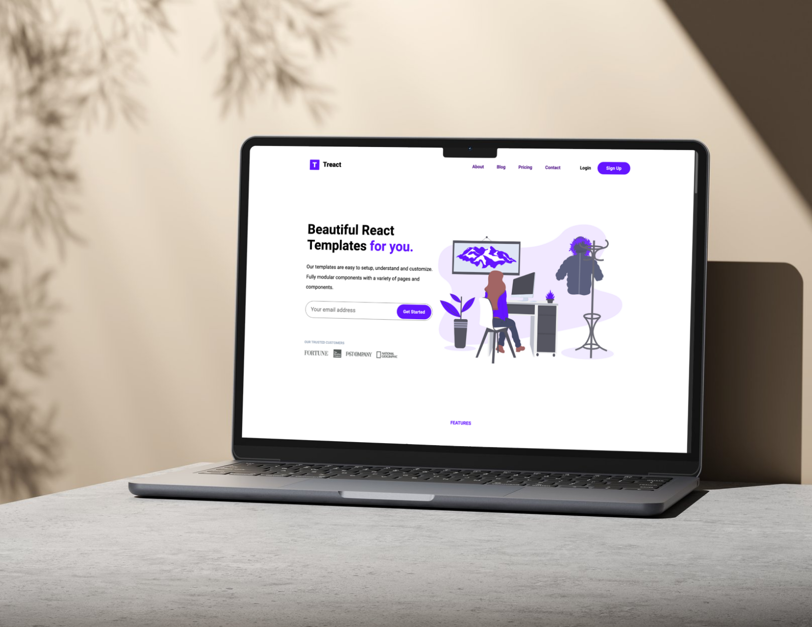

# 🌐 Treact Clone

**Treact Clone** is a responsive, interactive replication of the Treact social platform. Designed to showcase essential social media functionalities, this project demonstrates dynamic content interaction, UI responsiveness, and polished layout using core web technologies.

## 🚀 Features

- 📱 **Responsive Design** – Seamlessly adapts across mobile, tablet, and desktop devices.
- 💬 **Dynamic Content Interaction** – Create posts, engage with content via likes and comments, and see real-time updates.
- 🎨 **Polished UI** – Styled with **Bootstrap** and custom **CSS** for a clean, modern interface.

## 🧰 Tech Stack

| Category        | Technologies         |
|----------------|----------------------|
| **Frontend**    | HTML5, CSS3, JavaScript |
| **Styling**     | Bootstrap, Custom CSS |

## 📸 Screenshots

<!-- Optional: Add screenshots here -->


## 📦 Installation

To run this project locally:

```bash
git clone https://github.com/your-username/treact-clone.git
cd treact-clone
open index.html
